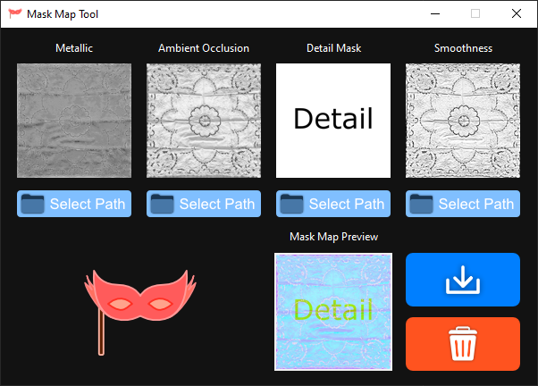
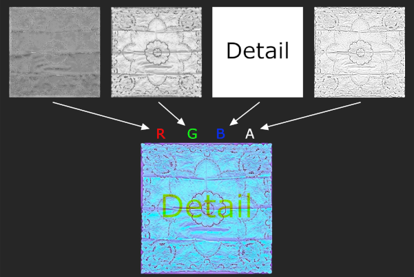

# Mask Map Tool
Mask Map Tool is a programme that enables you to create Mask Map textures the fast and convenient. [Mask Maps](https://docs.unity3d.com/Packages/com.unity.render-pipelines.high-definition@7.1/manual/Mask-Map-and-Detail-Map.html) are necessary for e.g. creating Materials for the High-Definition Render Pipeline of [Unity](https://unity.com/de/srp/High-Definition-Render-Pipeline). Mask Map Tool is currently available for Windows and Linux.
 
 

## How it works
Mask Map Tool takes the greyscale textures (Metallic Map, Ambient Occllusion Map, Detail Mask and Smoothness Map) and merges them to a single texture, the mask map (see image below).
 
 

## Installation
Official releases can be downloaded from the [release page](https://github.com/WorldOfPaul/MaskMapTool/releases)  
- **Windows**: Download the *.zip* file and unzip it. It contains a *.exe* file you can just run.  
- **Linux**: Download the *.zip* file and unzip it. Open your terminal, change directory to the unzipped folder and type:  
`sudo chmod +x install.sh`  
`sudo ./install.sh`  
You can find the application in the applications menu.  

### How to uninstall
- **Windows**: Just delete the *.exe* file.  
- **Linux**: In the unzipped folder type:  
`sudo chmod +x uninstall.sh`  
`sudo ./uninstall.sh`  

If everything worked, you successfully uninstalled MaskMapTool  

## How to build Mask Map Tool
Requirements:
- [Python 3.9](https://www.python.org/downloads/) or higher. Older versions may work but have not been tested  
- Every python module listed in [requirements.txt](https://github.com/WorldOfPaul/MaskMapTool/requirements.txt)  
- Source code  
- I used [PyInstaller](https://pyinstaller.org/en/stable/), which can be installed with `pip install pyinstaller`
  - **Windows**: Open the Command Prompt and change directory to the source directory and type the following:  
    `pyinstaller MaskMapTool.py --noconfirm --onefile --windowed --icon "PathToMaskMapTool/Assets/mask_icon.ico" --add-data "PathToMaskMapTool/Assets;Assets/" --            add-data "PathToPyhtonSite-Packages/tkinterdnd2;tkinterdnd2/"`  
  - **Linux**: Open the Terminal and change directory to the source directory and type the following:  
    `pyinstaller MaskMapTool.py --onefile --windowed --hidden-import="PIL._tkinter_finder" --add-data "PathToMaskMapTool/Assets/:Assets" --add-data "PathToPythonSite-      Packages/tkinterdnd2/:tkinterdnd2"`  
- If the build was successful you can find an executable inside the "dist" folder.

## How to help
Building MaskMapTool for macOS would be great, because macOS is not supported yet.

